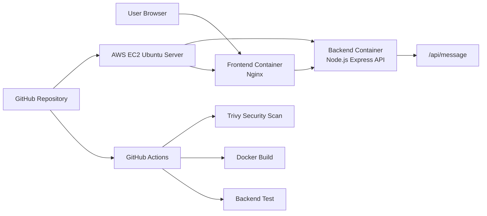

# DevOps Message App

A full-stack DevOps project that demonstrates containerization, CI/CD, cloud deployment, DevSecOps hardening, and performance benchmarking.

The application contains a simple frontend page that displays a message from a backend API.

## Features

- Frontend web page served by Nginx
- Backend API built with Node.js and Express
- Dockerized frontend and backend services
- Docker Compose for local and cloud deployment
- GitHub Actions CI/CD pipeline
- Jenkins deployment configuration
- Trivy security scanning
- npm dependency audit
- AWS EC2 cloud deployment
- Apache Benchmark load testing

## Architecture



## Tech Stack

| Layer | Technology |
|---|---|
| Frontend | HTML, JavaScript, Nginx |
| Backend | Node.js, Express |
| Containerization | Docker, Docker Compose |
| CI/CD | GitHub Actions, Jenkinsfile |
| Cloud | AWS EC2 |
| Security | Trivy, npm audit |
| Performance Test | Apache Benchmark |

## Prerequisites

- Git
- Node.js
- Docker
- Docker Compose
- AWS EC2 instance for cloud deployment
- Apache Benchmark (`ab`) for load testing

## Installation

Clone the repository:

```bash
git clone https://github.com/PKanta0/DevOps-Message.git
cd DevOps-Message
```

Install backend dependencies:

```bash
cd backend
npm install
npm test
```

## Running Locally

Run all services with Docker Compose:

```bash
docker compose up -d --build
```

Frontend:

```text
http://localhost:8080
```

Backend API:

```text
http://localhost:3000/api/message
```

Stop services:

```bash
docker compose down
```

## Docker Deployment

The project uses `docker-compose.yml` to run two services:

- `backend`: Node.js Express API exposed on port `3000`
- `frontend`: Nginx web server exposed on port `8080`

```bash
docker compose up -d --build
docker ps
```

## Cloud Deployment

The application was deployed on AWS EC2.

| Item | Value |
|---|---|
| Cloud Provider | AWS |
| Service | EC2 |
| Region | Europe (Frankfurt) |
| Instance Type | t3.micro |
| OS | Ubuntu Server |
| Public IP | 3.75.203.135 |

Public URL:

```text
http://3.75.203.135:8080
```

Backend API:

```text
http://3.75.203.135:3000/api/message
```

Deployment command on EC2:

```bash
cd ~/DevOps-Message
git pull origin main
docker compose up -d --build
```

## CI/CD Pipeline

The main CI pipeline is defined in:

```text
.github/workflows/pipeline.yml
```

Pipeline steps:

1. Checkout source code
2. Install backend dependencies
3. Run backend unit test
4. Build backend Docker image
5. Build frontend Docker image

The repository also includes:

```text
Jenkinsfile
deploy.sh
```

These files provide a Jenkins-based deployment flow for deploying the latest code to the EC2 instance.

## DevSecOps Security Scan

Security scanning is implemented with npm audit and Trivy.

Trivy workflow:

```text
.github/workflows/security-scan.yml
```

Scan targets:

- Source code and configuration
- Backend Docker image
- Frontend Docker image

Security audit summary:

| Item | Before | After |
|---|---:|---:|
| Total npm vulnerabilities | 4 | 0 |
| High vulnerabilities | 2 | 0 |
| Medium vulnerabilities | 2 | 0 |

Hardening improvements:

- Updated vulnerable backend dependencies
- Changed backend runtime to non-root user
- Used unprivileged Nginx image for frontend
- Added `no-new-privileges` in Docker Compose
- Added automated Trivy scan in GitHub Actions

## Performance Benchmark

Load testing was performed with Apache Benchmark:

```bash
ab -n 1000 -c 50 http://localhost:3000/api/message
```

Benchmark result:

| Metric | Before | After |
|---|---:|---:|
| Requests per second | 1046.89 req/sec | 1185.84 req/sec |
| Time per request | 47.761 ms | 42.164 ms |
| Failed requests | 0 | 0 |

Docker image size:

| Image | Before | After |
|---|---:|---:|
| Frontend | 92.7 MB | 81.4 MB |
| Backend | 285 MB | 235 MB |

## Project Structure

```text
DevOps-Message/
├─ backend/
│  ├─ Dockerfile
│  ├─ package.json
│  ├─ server.js
│  └─ test.js
├─ frontend/
│  ├─ Dockerfile
│  └─ index.html
├─ performance/
│  ├─ benchmark.sh
│  └─ PERFORMANCE_REPORT.md
├─ security-reports/
├─ .github/
│  └─ workflows/
├─ docker-compose.yml
├─ Jenkinsfile
├─ deploy.sh
├─ README.md
└─ TECHNICAL_REFLECTION.md
```

## Useful Commands

Run backend test:

```bash
cd backend
npm test
```

Run npm audit:

```bash
cd backend
npm audit
```

Check Docker images:

```bash
docker images
```

Run benchmark:

```bash
TARGET_URL=http://localhost:3000/api/message REQUESTS=1000 CONCURRENCY=50 bash performance/benchmark.sh after
```

## Author

Developed as part of a DevOps final project.
